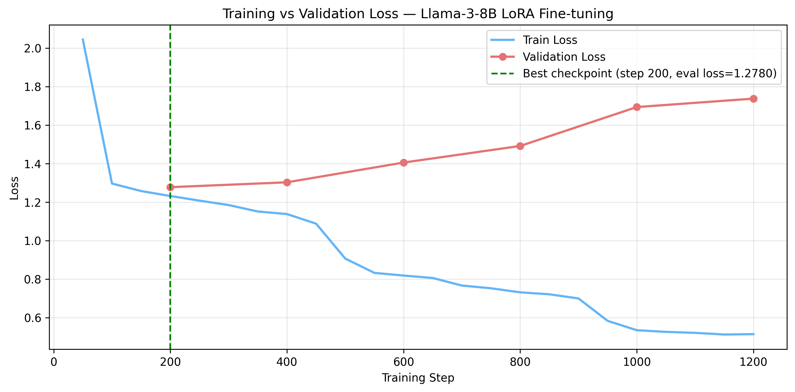

# Bias-Aware Fine-Tuning for Neutral News Summarization

**Master's Thesis Project** | Applied Data Science, Utrecht University (2025)  
Supervisor: Dr. Anastasia Giachanou

---

## Overview

Investigates whether LoRA fine-tuning of **Llama-3-8B-Instruct** can reduce political 
framing bias in LLM-generated news summaries, using the 
[AllSides/NeuS dataset](https://aclanthology.org/2022.findings-naacl.28/) 
(Lee et al., 2022).

**Task:** Given a single news article from a Left, Center, or Right-leaning source, 
generate a politically neutral summary.  
**Ground truth:** Expert-written roundup summaries synthesized from all three stances.

---

## Key Finding

Fine-tuning **significantly improved neutrality** (Cohen's d = +0.75, p < 0.001) but 
caused a **large drop in faithfulness** to the source article (d = −1.68, p < 0.001), 
revealing a fundamental neutrality–faithfulness trade-off.

The model overfit after **step 200 (epoch 0.44)** — validation loss diverged 
monotonically while training loss continued falling — consistent with the dataset's 
~68-word median article length providing insufficient signal for generalizable learning.

---

## Results

| Metric | Zero-shot | Fine-tuned | Cohen's d |
|--------|-----------|------------|-----------|
| Neutrality (0–5) | 3.37 | **4.01** | +0.75 |
| Faithfulness (0–5) | **4.14** | 2.60 | −1.68 |
| Roundup Alignment (0–5) | **3.13** | 2.39 | −0.87 |
| ROUGE-1 | **0.368** | 0.310 | — |
| ROUGE-L | **0.240** | 0.198 | — |
| BERTScore F1 | **0.303** | 0.222 | — |
| VAD Valence Spread | 0.392 | 0.379 | −0.05 (n.s.) |

All judge score differences significant at p < 0.001 (paired t-test, n = 921).  
VAD valence spread difference not significant (p = 0.51).

---

## Training Curve

Validation loss diverged from training loss immediately after the first checkpoint,
indicating rapid overfitting on truncated inputs.



---

## Pipeline

AllSides/NeuS dataset (307 stories × 3 stances = 921 test examples)
│

├── 01_EDA.ipynb

│     Dataset analysis, truncation quantification (~68 words/article),

│     per-story similarity, roundup stance alignment

│

├── 02_summary_generating.ipynb

│     Zero-shot inference: Llama-3-8B-Instruct, 4-bit NF4 quantization

│     Fine-tuned inference: LoRA adapter (best checkpoint: step 200)

│

├── 04_finetune.py

│     LoRA fine-tuning via HF TRL/SFTTrainer

│     r=16, α=32, dropout=0.05, lr=2e-4, cosine schedule

│     Target modules: q/k/v/o_proj, gate/up/down_proj

│

├── 03_llm_judge.py

│     GPT-4o-as-judge evaluation

│     Dimensions: Neutrality, Coverage, Faithfulness, Roundup Alignment

│     Calibrated rubric with anchor examples to prevent score inflation

│

└── 05_analyze.ipynb

ROUGE-1/2/L, BERTScore, Warriner VAD lexicon
Statistical tests (paired t-test, Cohen's d)
Training curve, error analysis

---

## Tech Stack

| Component | Tool |
|---|---|
| Base model | meta-llama/Meta-Llama-3-8B-Instruct |
| Fine-tuning | LoRA (PEFT) + HuggingFace TRL SFTTrainer |
| Quantization | bitsandbytes 4-bit NF4 |
| Compute | SURF/Snellius HPC (A100 GPU) |
| LLM Judge | GPT-4o (OpenAI API) |
| Lexical eval | ROUGE, BERTScore (roberta-large) |
| Affective eval | Warriner et al. (2013) VAD lexicon |
| Dataset | AllSides/NeuS — Lee et al., NAACL Findings 2022 |

---

## Dataset Note

Source articles are **truncated previews (~68 words median)**, not full news articles.
This reframes the task as *knowledge-augmented generation from partial input* rather 
than conventional summarization — a key limitation documented in the thesis.

The expert roundup ground truth shows measurable vocabulary bias toward center sources 
(TF-IDF similarity: center=0.267, right=0.241, left=0.220), meaning the "neutral" 
reference is itself not fully stance-neutral.

---

## Limitations

- Source articles are web-scraped previews, not full text (~68 words vs 400–800 word typical news articles)
- LoRA fine-tuning overfit after <1 epoch; best checkpoint used (`checkpoint-200`)  
- Expert roundup used as neutral ground truth has measurable center-leaning vocabulary bias
- Warriner VAD lexicon covers ~32% of political news vocabulary — weak signal for this domain
- 66% of topics appear across train/val/test splits (topic-level leakage)

---

## Setup

```bash
git clone https://github.com/iman-g/fine_tuning_llama_neutral_summary.git
cd fine_tuning_llama_neutral_summary
pip install -r requirements.txt

# Required environment variables (.env)
OPENAI_API_KEY=your_key_here   # for LLM judge
HF_TOKEN=your_token_here        # for Llama-3 access
```

**Note:** Dataset files and model weights are not included due to size and licensing 
constraints. The NeuS dataset is available from [Lee et al. (2022)](https://aclanthology.org/2022.findings-naacl.28/).

---

## Repository Structure
├── 01_EDA.ipynb                    # Exploratory data analysis

├── 02_summary_generating.ipynb     # Zero-shot + fine-tuned inference

├── 03_llm_judge.py                 # LLM-as-judge evaluation pipeline

├── 04_finetune.py                  # LoRA fine-tuning script

├── 05_analyze.ipynb                # Results analysis and visualization

├── results/

│   ├── training_curve.png          # Train vs validation loss

│   ├── judge_comparison.png        # Judge scores by model and stance

│   ├── rouge_comparison.png        # ROUGE/BERTScore comparison

│   ├── results_summary.csv         # Aggregated metrics (no raw text)

│   └── trainer_state.json          # Full training log

├── .env.example

├── requirements.txt

└── README.md

---

*Utrecht University — Applied Data Science MSc Thesis, 2025*
